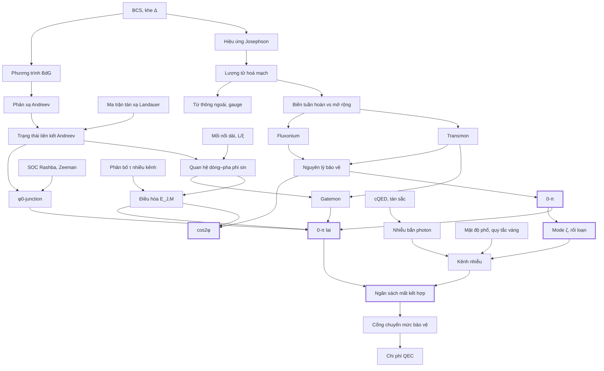

# Bản đồ khái niệm

Mũi tên $X \to Y$: cần nắm $X$ trước khi học $Y$. Nút đậm viền là lõi của luận án.

## Ba câu hỏi xuyên suốt

1. **Đối xứng nào, của biến nào?** — 0-π: phản xạ $\varphi\to-\varphi$, tịnh tiến $\theta\to\theta+2\pi$ (Bloch), hoán vị hai nhánh. cos2φ: chẵn lẻ $e^{i\pi\hat n}$.
2. **Tham số nào phá đối xứng, tham số đó có điều khiển được không?** — $dE_J$ (cổng: có), $dE_L$, $dC$, $dC_J$ (cổng: không), $\varphi_0$ (cổng + $B$: có, nhưng là nguồn phá mới).
3. **Kênh nhiễu nào thấy phần phá vỡ đó?** — xem [D2](d-noise/d2-channels.md), [DV3](derivations/dv3-zeta-coupling.md).
