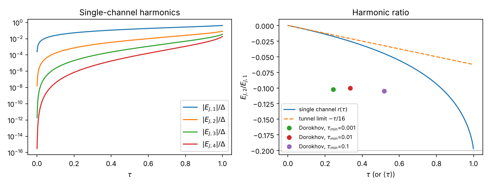

# DV1. Hệ số Fourier của thế Beenakker

Mức: L3 + L4. Mã: `hpq/andreev.py`, test: `tests/test_andreev.py`, hình: `scripts/fig_beenakker_harmonics.py`.

## 1. Phổ ABS một kênh từ điều kiện lượng tử hoá

Một kênh, mối nối ngắn, ma trận tán xạ thường đối xứng $s=\begin{pmatrix}r&t'\\t&r'\end{pmatrix}$, $|t|^2=\tau$.
Electron ở $E$ lan sang phải, phản xạ Andreev ở S phải (pha $-\arccos(E/\Delta)-\phi_R$), lỗ lan sang trái qua $s^*$, phản xạ Andreev ở S trái (pha $-\arccos(E/\Delta)+\phi_L$). Điều kiện vòng kín:
$$\det\!\big[1-e^{-2i\arccos(E/\Delta)}\,R_A\,s^*\,R_A^*\,s\big]=0 ,\quad R_A=\mathrm{diag}(e^{i\phi_L},e^{i\phi_R}).$$
Đặt $E=\Delta\cos\beta$. Với $s$ $2\times2$ tính định thức, dùng $|r|^2=1-\tau$ và tính unita:
$$\cos^2\beta = 1-\tau\sin^2\frac{\varphi}{2}\;\Rightarrow\;E=\pm\Delta\sqrt{1-\tau\sin^2(\varphi/2)}.$$
**Bài tập:** viết đầy đủ bước khai triển định thức (khoảng 6 dòng). Chỗ dễ sai: liên hợp phức của $s$ cho lỗ là $s^*(-E)\approx s^*(0)$.

**Kiểm chứng số (L4):** `hpq.tightbinding` dựng chuỗi 1D S–N–S, rào một nút cho $\tau=[1+(V/2t\sin k_F)^2]^{-1}$. Sai số so với Beenakker tỉ lệ $L_{eff}/\xi\propto\Delta$ — test `test_tight_binding_abs_converges_to_beenakker` kiểm sai số giảm một nửa khi $\Delta$ giảm một nửa. Đây chính là hiệu chỉnh độ dài hữu hạn của [B3](../b-microscopic/b3-beyond-short.md) ở dạng thô.

## 2. Hệ số Fourier

$E_{J,M}(\tau)=\frac{\Delta}{\pi}\int_{-\pi}^{\pi}\sqrt{1-\tau\sin^2(\varphi/2)}\cos M\varphi\,d\varphi$.

**Giới hạn đường hầm.** $\sin^2(\varphi/2)=\tfrac12(1-\cos\varphi)$, $\sin^4(\varphi/2)=\tfrac18(3-4\cos\varphi+\cos2\varphi)$.
$\sqrt{1-x}=1-\tfrac x2-\tfrac{x^2}8-\ldots$ ⇒ hệ số $\cos\varphi$: $\frac\tau4+\frac{\tau^2}{16}$; hệ số $\cos2\varphi$: $-\frac{\tau^2}{64}$.
$$E_{J,1}\simeq\Delta\Big(\frac\tau4+\frac{\tau^2}{16}\Big),\qquad E_{J,2}\simeq-\frac{\Delta\tau^2}{64},\qquad r\simeq-\frac{\tau}{16}.$$
Tổng quát $E_{J,M}=O(\tau^M)$: điều hòa thứ $M$ = đồng xuyên hầm $M$ cặp Cooper, cần $M$ lần truyền.

**Giới hạn trong suốt.** $\sqrt{1-\sin^2(\varphi/2)}=|\cos(\varphi/2)|$:
$$E_{J,M}(1)=\frac{4\Delta}{\pi}\frac{(-1)^{M+1}}{4M^2-1}\;\Rightarrow\;E_{J,1}=\frac{4\Delta}{3\pi},\;E_{J,2}=-\frac{4\Delta}{15\pi},\;r=-\frac15 .$$
Suy giảm chỉ $\propto M^{-2}$ (do điểm gãy tại $\varphi=\pi$) ⇒ cắt cụt Fourier hội tụ chậm khi $\tau\to1$.

**Giá trị tại các điểm làm việc** (tính bằng `fourier_coefficients`, khớp Bảng 1 đề cương):

| $\tau$ | $E_{J,1}/\Delta$ | $E_{J,2}/\Delta$ | $E_{J,3}/\Delta$ | $E_{J,4}/\Delta$ | $r$ | $E_{J,3}/E_{J,1}$ |
|---|---|---|---|---|---|---|
| 0,50 | 0,1459 | −0,0062 | 0,0005 | −0,0001 | −0,043 | 0,004 |
| 0,90 | 0,3299 | −0,0413 | 0,0105 | −0,0034 | −0,125 | 0,032 |
| 0,99 | 0,4082 | −0,0745 | 0,0285 | −0,0139 | −0,182 | 0,070 |
| 1,00 | 0,4244 | −0,0849 | 0,0364 | −0,0202 | −0,200 | 0,086 |

## 3. Nhiều kênh — một kết quả cần đưa vào ND1

$r_{eff}=\sum_nE_{J,2}(\tau_n)/\sum_nE_{J,1}(\tau_n)$. Với phân bố Dorokhov (diffusive), mô phỏng cho $r_{eff}\approx-0{,}10$ **gần như độc lập** với cắt dưới $\tau_{min}$ (tức độc lập với $\langle\tau\rangle$ trong khoảng 0,2–0,5), trong khi $r(\langle\tau\rangle)$ chỉ cỡ $-0{,}016$ ở $\langle\tau\rangle=0{,}22$. Lý do: phân bố lưỡng mốt có trọng số $\propto(1-\tau)^{-1/2}$ tại $\tau\to1$ và các kênh gần trong suốt chi phối điều hòa bậc cao.

**Hệ quả:**
1. Khẳng định trong đề cương "mô hình một kênh cho cận trên của điều hòa bậc hai" là **sai** cho mối nối diffusive (test `test_multichannel_is_not_bounded_by_single_channel`).
2. Mối nối 2DEG thực (quasi-ballistic, có tán xạ) nằm giữa ballistic ($r\to-0{,}2$ cho kênh mở) và diffusive ($r\approx-0{,}1$). Đo độ bất điều hòa (Kringhøj 2018) cho $\sum\tau^2/\sum\tau$ — một ràng buộc lên phân bố; dùng nó để giới hạn $r_{eff}$.
3. Bài tập: tìm $r_{eff}$ giải tích cho Dorokhov (gợi ý: tích phân $\int\rho(\tau)E_{J,M}(\tau)d\tau$ với $\tau=1/\cosh^2x$; liên hệ với CPR Kulik–Omelyanchuk KO-1).

*(hình sinh bởi `python code/scripts/fig_beenakker_harmonics.py`)*
