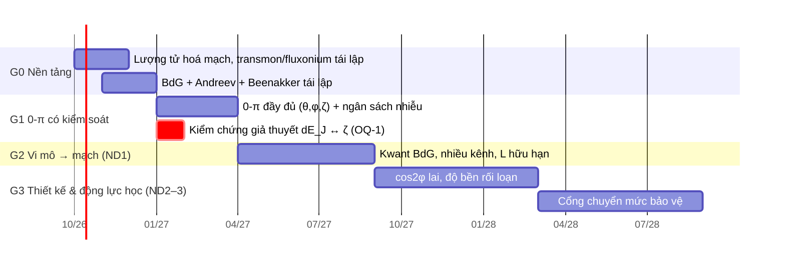

# Lộ trình nghiên cứu

Bốn giai đoạn, mỗi giai đoạn kết thúc bằng một **cổng kiểm tra** (deliverable kiểm chứng được), không theo thời lượng đọc.

## G0 — Nền tảng (≈ 3 tháng)

**Học:** [A1](a-circuit/a1-circuit-quantization.md), [A2](a-circuit/a2-compact-extended.md), [B1](b-microscopic/b1-bdg-andreev.md), [B2](b-microscopic/b2-scattering-abs.md), [D1](d-noise/d1-framework.md), [E1](e-numerics/e1-diagonalization.md).

**Cổng kiểm tra G0:**
- [ ] Tự lượng tử hoá transmon, fluxonium, mạch 0-π 4 nút từ sơ đồ mạch (không nhìn tài liệu); khớp Hamiltonian của Groszkowski 2018.
- [ ] Tái lập độ tán sắc điện tích transmon (Koch 2007, Fig. 4) bằng mã tự viết, sai số < 1% so với nghiệm Mathieu chính xác.
- [ ] Dẫn xuất phương trình Beenakker $E_A=\pm\Delta\sqrt{1-\tau\sin^2(\varphi/2)}$ từ điều kiện lượng tử hoá ma trận tán xạ.
- [ ] `pytest code/tests/test_andreev.py` xanh; hiểu từng test.

## G1 — 0-π có kiểm soát (≈ 3 tháng)

**Học:** [C1](c-protected/c1-protection-principles.md), [C2](c-protected/c2-zero-pi.md), [D2](d-noise/d2-channels.md), [DV2](derivations/dv2-zero-pi-harmonics.md), [DV3](derivations/dv3-zeta-coupling.md).

**Cổng kiểm tra G1:**
- [ ] Tái lập bảng tham số và $T_1$, $T_2$ ước lượng của Groszkowski 2018 và Gyenis 2021 (soft 0-π).
- [ ] **Giải quyết OQ-1** (xem [câu hỏi mở](open-questions.md)): mode ζ ghép qua tham số nào? Quyết định này định hình lại lập luận "cân bằng cổng nâng $T_{2R}$" của đề cương.
- [ ] Ngân sách mất kết hợp đầy đủ cho 0-π lai, gồm nhiễu cổng và QP — dù chỉ ở mức bậc độ lớn.
- [ ] Bản thảo bài báo 1.

## G2 — Vi mô → mạch, Nội dung 1 (≈ 5 tháng)

**Học:** [B3](b-microscopic/b3-beyond-short.md), [B4](b-microscopic/b4-junction-to-circuit.md), [E2](e-numerics/e2-kwant-bdg.md).

**Cổng kiểm tra G2:**
- [ ] Mô hình Kwant mối nối phẳng InAs/Al cho $E_{GS}(\varphi)$, so với Beenakker ở giới hạn ngắn (sai số < 1%).
- [ ] Bản đồ $\{E_{J,M}(V_g)\}_{M\le 4}$ và $r(V_g)$, kèm thanh sai số do $L/\xi$, phân bố $\tau$, metallization.
- [ ] Trả lời định lượng: với hai mối nối nhiều kênh, cân bằng $E_{J,1}$ để lại $dE_{J,2}$ bao nhiêu? (OQ-2)

## G3 — Thiết kế & động lực học, Nội dung 2–3 (≈ 12 tháng)

**Học:** [C3](c-protected/c3-cos2phi.md), [C4](c-protected/c4-other-designs.md), [F1](f-control/f1-protected-gates.md), [G1](g-architecture/g1-qec-overhead.md).

**Cổng kiểm tra G3:**
- [ ] Phân tích cos2φ lai: độ bền bảo vệ theo $\delta E_{J,1}$ dư, nhiễu cổng, QP.
- [ ] Mô phỏng Lindblad một cổng chuyển mức bảo vệ, có rò rỉ và giới hạn băng thông đường cổng.
- [ ] Bài báo 2.

## Nhịp hàng tuần

| Việc | Tần suất | Đầu ra |
|---|---|---|
| Đọc L2 | 2 bài/tuần | `papers/notes/*.md` |
| Dẫn xuất L3 | 1/tuần | `derivations/*.md` |
| Mã L4 | liên tục | test xanh + script |
| Rà câu hỏi mở | cuối tuần | cập nhật `open-questions.md` |
